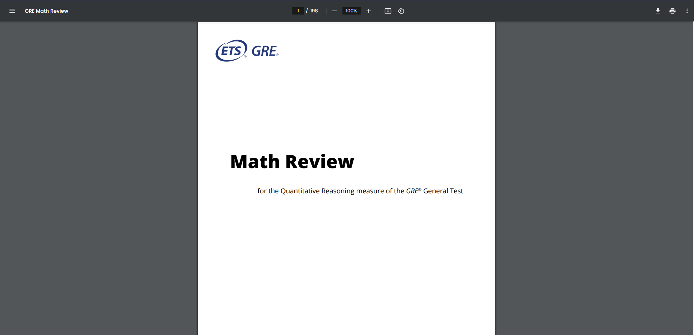

### Question: 
Why does every pdf have to be with white background and a black text color? 

## Seeking for solution 🚶‍♂️
I've been frustruated and seek help for this problem. Then came across this amazing thread by in Reddit by user: [@polysoma - Reddit](https://www.reddit.com/r/chrome/comments/e3txhi/comment/fem1cto/). 

## About My Solution ✅
With magic from @polysoma "Dark Theme css code" & chrome's extension, I made a chrome extension <i>(Tested in brave only - with base chromium)</i> which creates a dark theme 

## Where does it work?
### Default Behaviour: for local pdf only
* Whenever a pdf stored in local is opened in chrome, by default dark theme will be enabled. 

### However, this theme can be turned on and off by clicking the extension icon. 

## NOTE:
1. This theme can be applied to every page by clicking the icon
2. <b>Turns dark screen to white & white screen to black </b>

# How to install:
1. chrome -> settings -> manage extension -> turn on developer settings
2. click "Load unpacked"
3. select choose folder "dark_theme_code"

# Permission Required:
Enable setting to read PDFs stored locally

# Sample screenshot:

### Extension Icon:

### For other sites:  
#### before: 

#### After: 

### For PDF:  
#### Light theme :  

#### Dark theme: <I>Default behaviour</i>  

